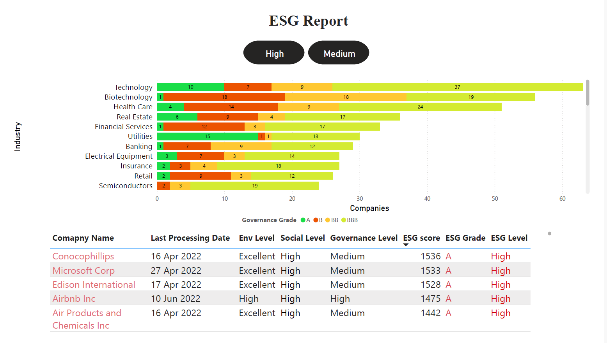
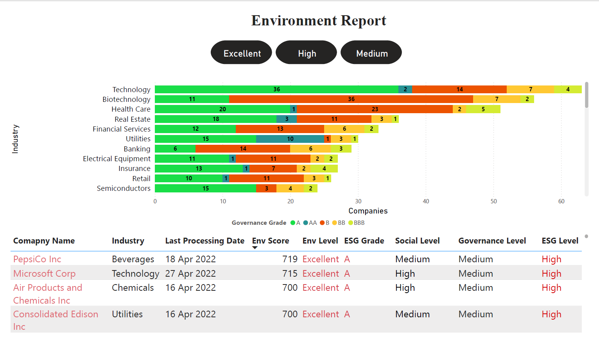

# PowerBI_Public-Company-ESG-Ratings
ESG Ratings for Top Public Companies using Power BI where ESG ratings for over 700 mid / large-cap companies across various industries have been analysed as follows:

1. Overall ESG Insights for Industries

   The data below demonstrates the categorisation based on ESG Levels which are further drilled down based on ESG grades.
   

2. ESG Report

   This report explains the performance of each industry based on ESG grades. The button filters above helps to filter out Industry based on the selected Grade. This filter further segregates data in the List of Companies table which shows details of each company belonging to the selected category.

2. Environment Report

   This report focuses on Environemnt grades and explains the performance of each industry. The button filters above helps to filter out Industry based on the selected Grade. This filter further segregates data in the List of Companies table which shows details of each company belonging to the selected category.
   

2. Social Report

   This report focuses on Social grades and explains the performance of each industry. The button filters above helps to filter out Industry based on the selected Grade. This filter further segregates data in the List of Companies table which shows details of each company belonging to the selected category.

2. Governance Report

   This report focuses on Environemnt grades and explains the performance of each industry. The button filters above helps to filter out Industry based on the selected Grade. This filter further segregates data in the List of Companies table which shows details of each company belonging to the selected category.

